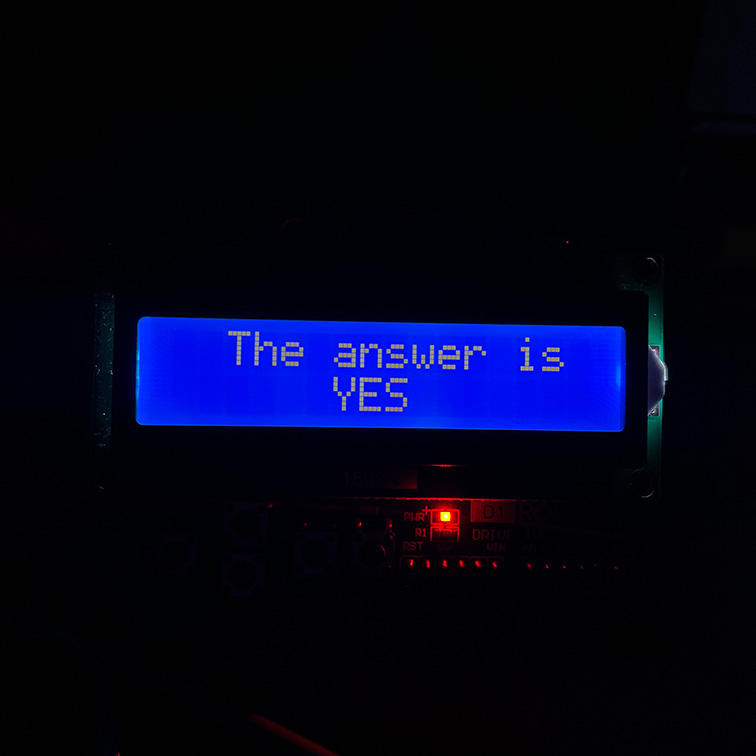
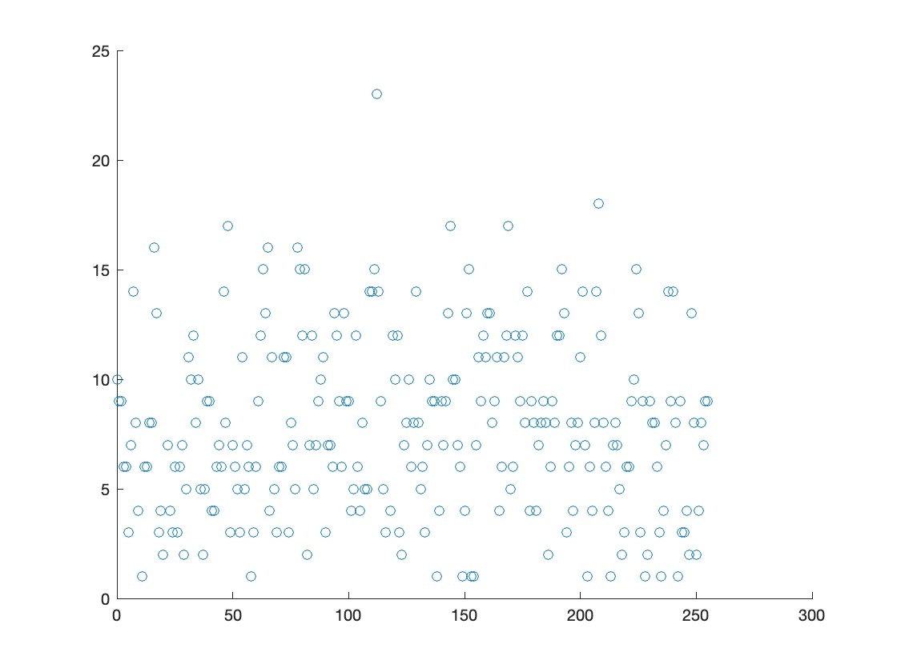

# Alex's collection of Arduino projects

## Eight Ball

*“Ah... yes, I can hear the spirits whispering something to me... ”*

A simple implementation of an 8 ball with analog pins as a source of randomness.

### How does it work

The prediction is based on an 8-bit binary number generated from the entropy of two analog pins. Since analog pins are not a reliable source of entropy, [Von Neumann extractor](https://en.wikipedia.org/wiki/Randomness_extractor) is used to obtain a unified output. Process is repeated until an 8-bit binary number is generated. After that the number is converted into a decimal that is evaluated against three buckets for each respective option.

Below is the scatter plot demonstrating no visible corellation between the values and counts of each value. Values have been generated using Arduino UNO with ATmega328P chip.

